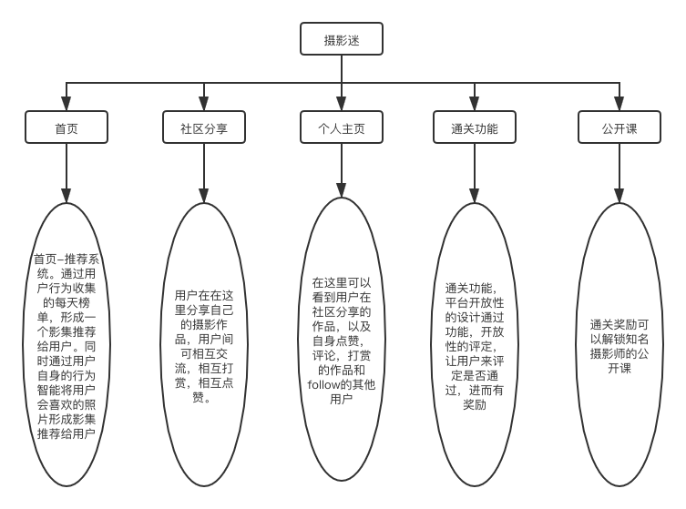
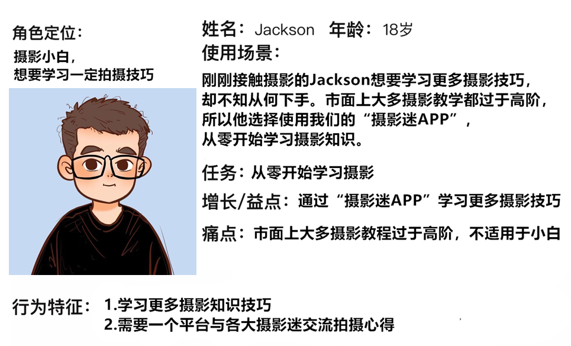
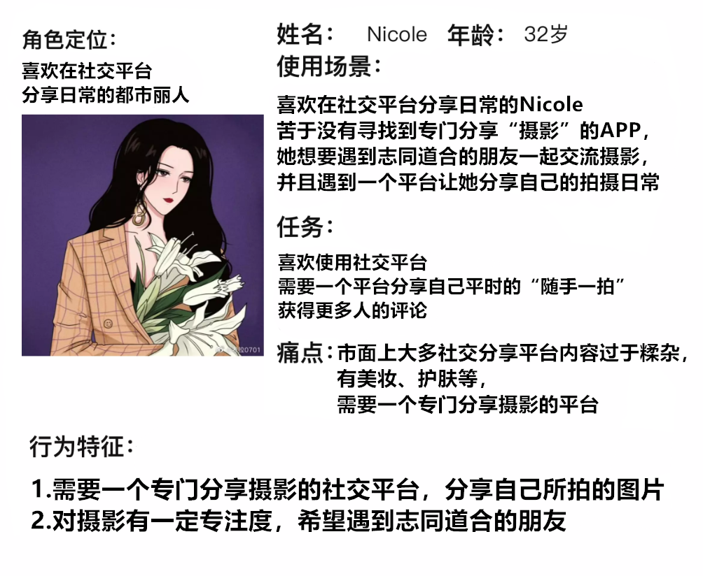
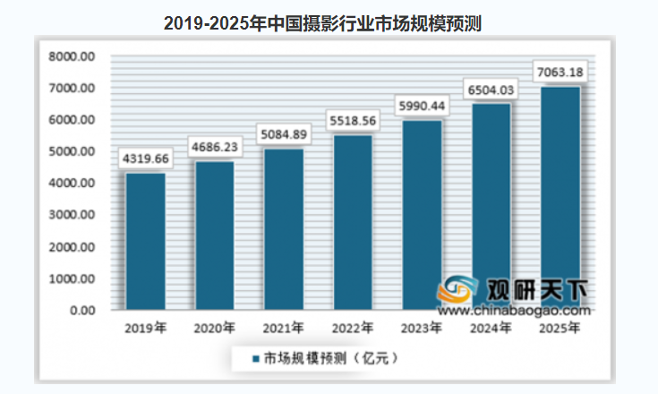
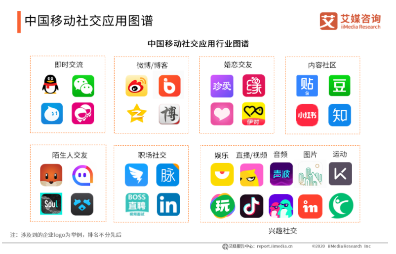
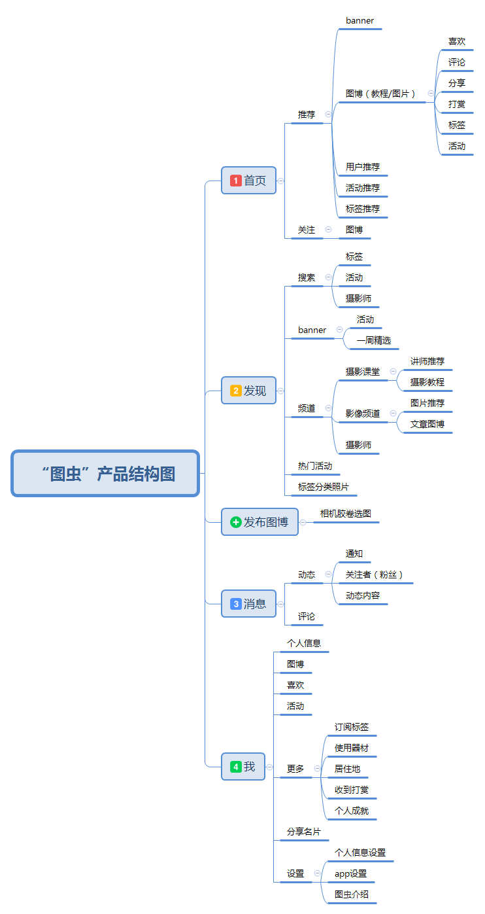
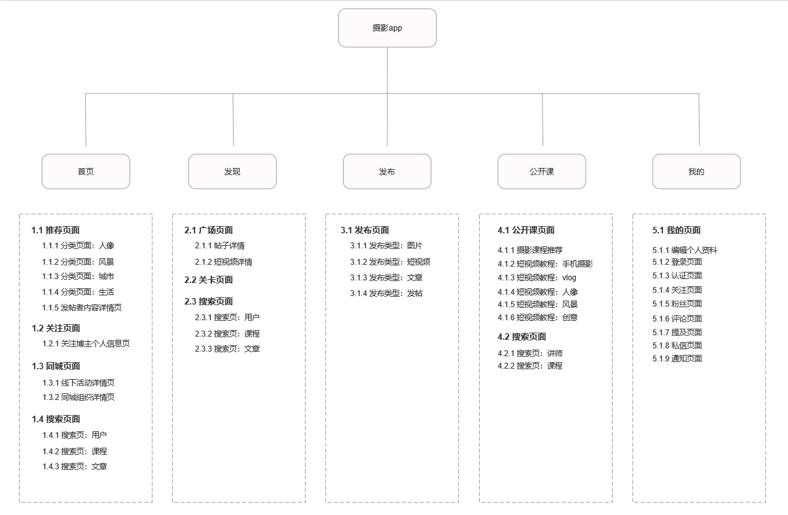

# 项目介绍
|项目名称|摄影迷需求文档|
|----|----|
|产品名称|摄影迷|
|产品描述|一个为摄影爱好者准备的学习摄影相关知识以及摄影技巧分享的社区分享平台。|  
|产品版本|1.0|
|产品现状|进行中|
|项目成员|冯雅雯、陈怡霖、刘咏琳、吕泓鹭、陈颖、吴润森、范沛坤|  

# 背景
* 图片处理类APP的用户数量庞大。据媒体报道，截至2017年4月，2015年估值就达到350亿元的图片分享应用Instagram，月活跃用户已超过7亿。在国内，2016年6月美图旗下App的月活用户达到4.46亿，后起之秀Faceu目前用户突破4000万。  
* 同时，图片处理类APP的市场价值日益凸显。图片类APP自带流向属性，在产品即媒体的时代，可以通过APP自身的广告投放实现精准化营销。例如，美图公司2016年赴港上市时，市值达359亿港元。

# 一、产品需要概况

## 1、产品定位
摄影迷，一个为摄影爱好者准备的学习摄影相关知识以及摄影技巧分享的社区分享平台。

## 2、产品理念
- 在以上背景下，我们看到了时下年轻人间的流行趋势，对于图片的要求是相当高的，但是不是每一个摄影爱好者都能进行系统化的摄影技巧学习，而我们的出现就是为了让这一群体能集合且进行更为深入的学习以及交流。
- 我们的产品也是我们对于当下我们所看到的热点，我们所能接受的轻松的学习方式的集合，把我们所能做到都表达出来。即然更多人参与到摄影，让更多人体会到摄影的乐趣，进而拍摄出更好的作品。

## 3、产品亮点
  -  **1）通关功能：**
平台设置关卡，让用户相互的行为进行评定，形成一个开发的通关机制，用户通过闯关提升自身拍摄水平。建立闯关榜单，提供相应奖励，推广机会。  
  - **2）公开课：**
拥有专业的摄影师公开课程，让用户能学习更专业的摄影技巧。  
  - **3）推荐系统：**
通过各用户行为建立实时榜单，最后形成每日排行。同时对于用户自身，通过点赞，打赏，下载等指标数据，生成用户个性化每日推荐影集。  
  - **4）奖励机制：**
通过社区分享的作品获得的点赞，打赏，下载量，以及通关质量进行积分制。进而可以兑换公开课程。 
- **5）“follow”机制：**
用户可以follow其他用户，参与其发起的摄影主题活动等。

## 4、产品核心目标
让零基础的摄影爱好者能通过我们设计的闯关关卡来提高自身的摄影水平，同时让有摄影基础在社区分享作品拍摄经验，让用户能相互交流经验。从而解决用户对于摄影技巧不了解以及对于提升水平的需求。

## 5、产品的结构图

## 6、产品路线图
* **1）前期**  
  + **目标：通关功能的建设**  
过程：  
A、	对于关卡设计的合理性的研究，从简到难，需要专业人士的指导；同时对于通关成功的评定，需要与多个知名摄影工作室共同设立。  
B、	风格化的图片库建立，摄影风格分很多种，有些很难鉴定。所以对于零基础的摄影爱好者，我们需要建立鲜明的风格库让用户能在初期就对各风格有一个清楚的认识。  
C、	通关模式的建设，用什么界面，如何交互合理，需要一再的修改。 
  + **重点：合理设计关卡以及界面交互**  
* **2）中期**    
  + **目标：图片分享以及编辑页面的建设**    
过程：  
A、	能在用户进入平台初期，让用户自己DIY出一款个性化的涂鸦。  
B、	推出平台独有的涂鸦，模版，滤镜等等。  
C、	更人性化的图片美化功能，方便于用户的使用。  
D、	用户可以设置一个适合自身的美化模版，从而后期可以一键美化。  
E、	平台自身也会有一个一键美化，供用户参考。
  + **重点：个性化服务**  
* **3）后期**  
  +  **目标：社区分享**  
过程：  
A、	摄影作品分享，让用户间相互自由交流，吸取相互的经验。  
B、	与通关功能结合，到榜单top，为该用户提供全平台的其摄影作品推广。  
C、	每日优秀作品推荐，将每日喜爱数量高的作品集合成一个相册。  
D、	根据用户的喜好，每日推荐其会喜欢的摄影作品集。  
E、	分享各大杂志摄影优秀以及获奖作品。  
  + **重点：分享社区建设** 

## 7、产品的功能需求
* 1）通关功能    
通关页面，平台设置关卡，用户通过闯关提升自身拍摄水平。建立闯关榜单，提供相应奖励，推广机会。  
* 2）编辑功能    
个性化编辑服务，让用户成为热门模版的制作人，进一步推广。  
* 3）推荐功能    
将每日用户喜欢数多的作品集合；各大优秀、获奖的登刊作品集合；用户喜欢风格的作品集等进行每日推荐

## 8、非功能性需求
* 1）有限性  
设计关卡的合理性以及其评定的合理性，仍有待考察。  
* 2）运营需求  
需要有热门的话题以及模版来带领后续的运营。 

## 9、目标用户
* **1）摄影爱好者**  
  + **1.1爱好摄影（零基础），想学习相关技能**  
  + **1.2爱好摄影（有一定基础），乐于分享摄影技巧**  
* **2）社交媒体常用者**  
  + **2.1乐于分享自己生活**
  + **2.2对摄影内容有一定关注度**

# 二、市场调研
## 1、市场现况
- 随着摄影工具的普及，以及传播渠道的丰富便捷，人们对摄影的需求呈现出多元化的态势，这带来了整个摄影行业的蓬勃发展。据人像摄影学会报告，2020年底，中国人像摄影行业总产值达2060亿元，比上年增长24.2%，产值增速远高于国家GDP增速。

- 与此同时，数据显示，2019上半年中国即时通信应用使用率达到96.9%， 即时通信所代表的移动社交已成网民生活常态，随着国内移动社交生态的发展，预计到2020年用户规模将突破9亿。庞大的移动社交用户规模也意味着更多的市场可能性，而以95后、00后为主的年轻新世代逐渐成为中国移动社交市场的主力军。这部分年轻用户更青睐于轻松、趣味社交形式， 偏好新潮、有趣、多元的社交场景。

- 我们能够发现，如今市面上专门的摄影分享平台稀缺，大部分分享平台内容过于糅杂。“摄影迷APP”作为一个专门的摄影分享平台能填补市场上的空缺。

## 2、竞品分析：图虫
* 1）产品定位
通过摄影交流这一主题，来满足职业摄影师或小白摄影师的需求交流，打造领域细分化的社交圈
* 2）产品结构 

* 3）目标用户 
1. 比较喜欢交朋友，但是性格内向，爱好摄影却未入门的小白
2. 爱好摄影且有一定基础，因为工作原因周边没有交流爱好的朋友
3. 摄影专业人员，有自己的工作室，喜欢给大家分享经验
* 4）亮点功能
1. gif评论：强评论互动性，从而增加用户粘性，提高用户存留
2. 原创保护：保护用户原创作品，通过佣金分成激励用户发布创作
* 5）对比
1. 图虫的首页界面较为混乱，把许多功能糅杂在一起，造成用户视觉疲劳，而本产品界面简洁清晰
2. 图虫添加过多不必要的页面因素，如首页自动播放视频、音乐等，有违平静技术设计原则
 
# 三、产品架构图

